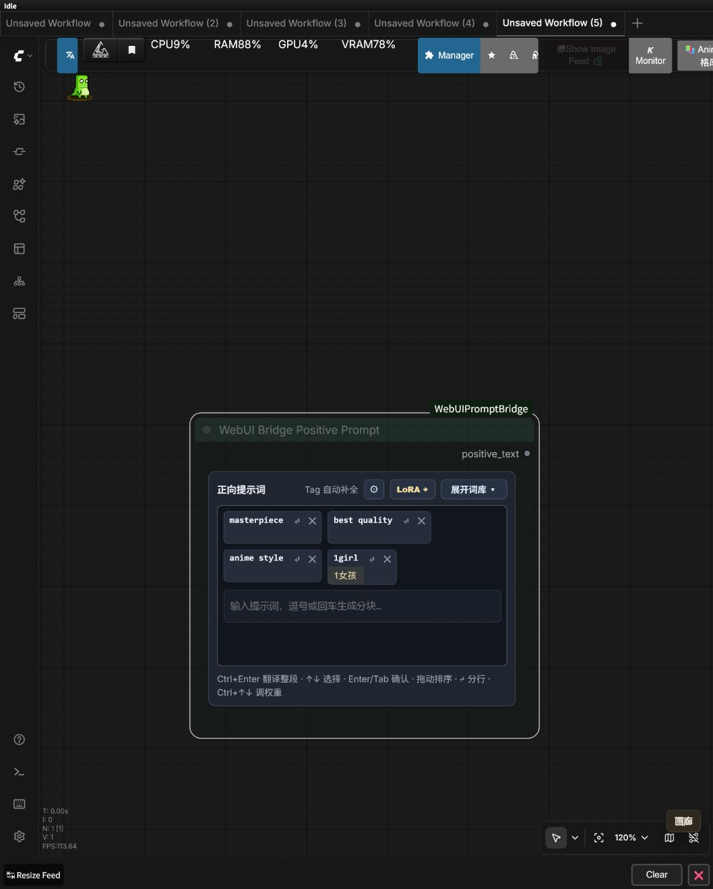
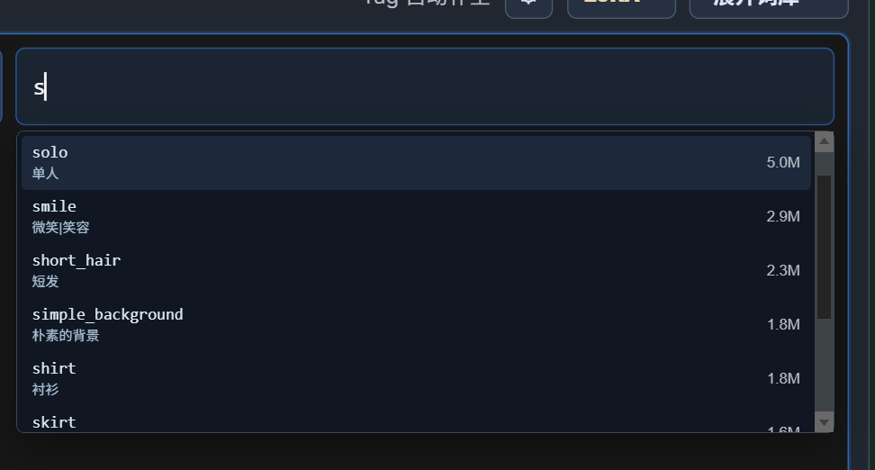

# ComfyUI WebUI Prompt Bridge v0.4.24

这次更新把主节点里最常用的提示词能力拆成了两个轻量节点。只想快速写正向词或负向词时，不必再放下完整工作台；需要完整模型、区域控制和生成参数时，原来的主节点仍然照常使用。

## 新增正向与负向提示词小节点

- 新增 `WebUI Bridge Positive Prompt` 和 `WebUI Bridge Negative Prompt`。
- 默认使用分块编辑：输入提示词后按逗号、回车或 `Tab` 生成 Tag，可多选、删除、双击修改并拖动排序。
- 每个 Tag 都可设置 `↵` 真实换行；继续输入、从词库添加或加入 LoRA 时，分行结构仍会保留。
- 节点可以自由调整宽高，保存工作流并刷新后会恢复上次尺寸。
- 分类词库默认折叠，展开后可使用搜索、中文翻译、收藏和主节点同款分类；收回后恢复展开前大小。
- 小齿轮可以切换分块/普通文本模式，并设置整段翻译快捷键。

## 正向小节点也能真正加载 LoRA

- `LoRA +` 可按名称、目录和权重快速加入 LoRA。
- 列表同步主节点的分类、文件夹、模型版本与整理状态，主节点修改分类后再次打开即可看到最新结果。
- 接入基础 `model`、`clip`，再使用小节点输出的 `model`、`clip`，LoRA 会像主节点一样真正应用到工作流。
- 大量 LoRA 卡片保持完整缩略图与名称，并在固定区域内滚动，不再挤成细条。

## 自动补全下载后直接可用

GitHub 下载包和 ComfyUI Registry 包现在直接携带完整 Danbooru 主 Tag 数据与中文映射。没有安装 WebUI 或 TagComplete、选择“使用内置数据”，甚至离线时，主节点和两个小节点仍可显示英文 Tag、中文解释与热度数量。

## 升级说明

- 原有主节点和旧工作流继续兼容，不需要重建工作流。
- 更新后请重启 ComfyUI，并在浏览器中按 `Ctrl+F5` 强制刷新。
- 本版本同步发布到 ComfyUI Registry，包版本为 `0.4.24`。
