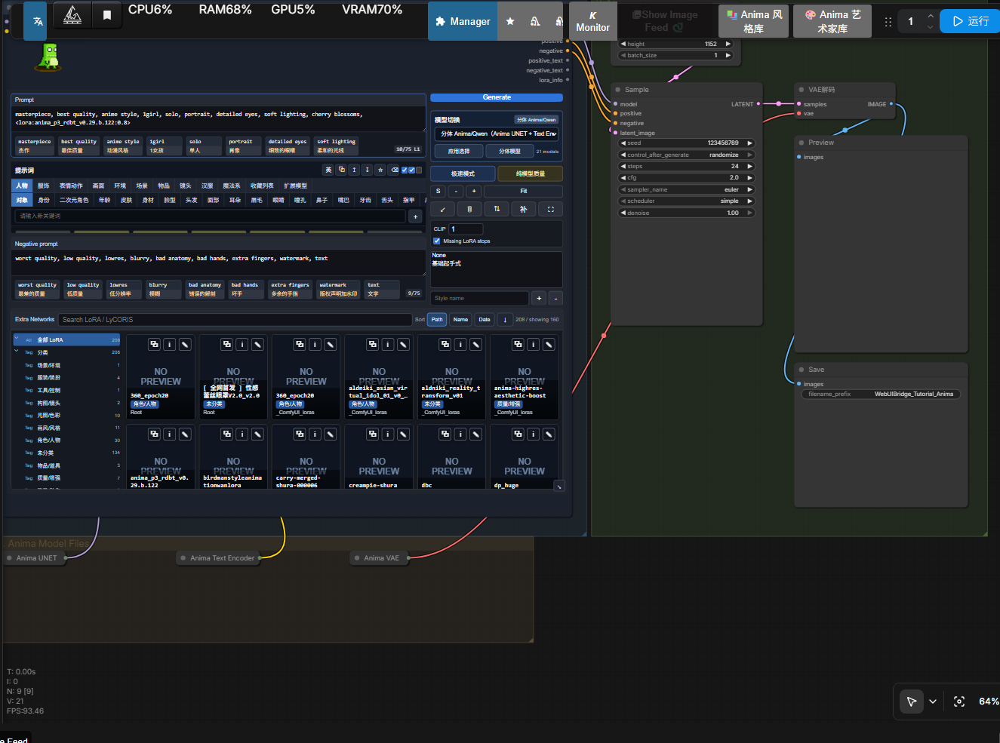
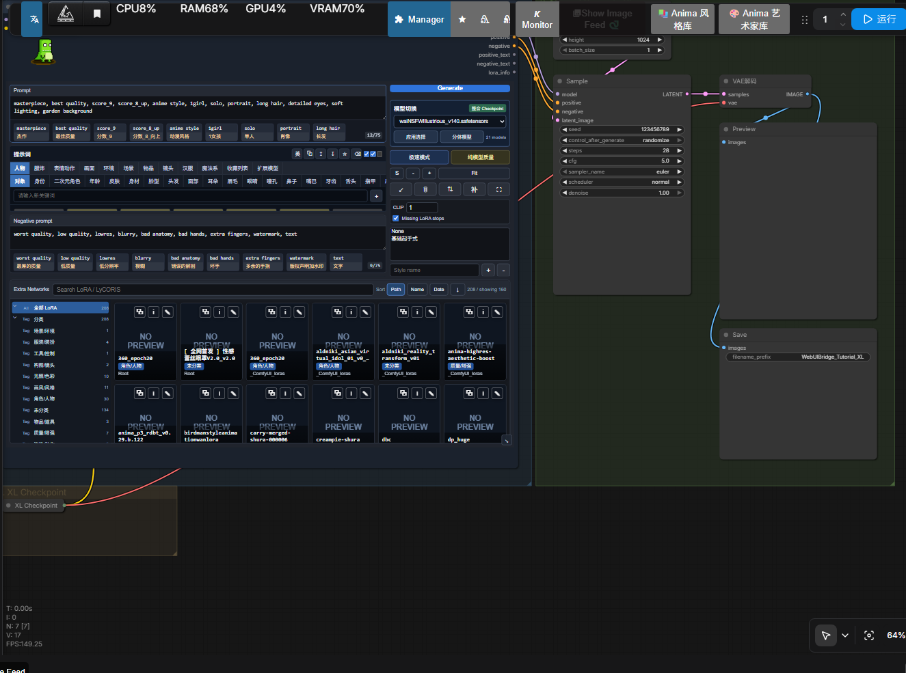

# WebUI Prompt Bridge 最小工作流教程

这份教程用于快速演示 `WebUI Prompt Bridge` 节点的最小用法。仓库提供三份最小工作流：一份使用 Anima 分体模型，一份使用 XL 整合 checkpoint，一份使用 XL checkpoint 做图生图重绘。它们都只保留最核心的生成链路，适合新用户学习节点如何接线。

## 工作流文件

| 场景 | 文件 | 适合演示 |
| --- | --- | --- |
| Anima 分体模型 | `workflows/tutorial-minimal-anima-webui-prompt-bridge.json` | `UNET + CLIP + VAE` 分体加载 |
| XL 整合模型 | `workflows/tutorial-minimal-xl-webui-prompt-bridge.json` | `CheckpointLoaderSimple` 整合模型加载 |
| XL 图生图 | `workflows/xl-img2img-webui-prompt-bridge.json` | `LoadImage -> VAEEncode` 最小重绘链路 |

## Anima 最小工作流



这条链路使用：

```text
UNETLoader + CLIPLoader + VAELoader
-> WebUI Prompt Bridge
-> KSampler
-> VAEDecode
-> PreviewImage / SaveImage
```

默认模型文件名：

```text
anima_baseV10.safetensors
anima_baseV10_txt.safetensors
qwen_image_vae.safetensors
```

默认提示词里演示了一个 Anima LoRA 写法：

```text
<lora:anima_p3_rdbt_v0.29.b.122:0.8>
```

如果本机没有这个 LoRA，可以在面板右侧取消勾选 `Missing LoRA stops`，或者直接删掉这段 LoRA 标签。

## XL 最小工作流



这条链路使用：

```text
CheckpointLoaderSimple
-> WebUI Prompt Bridge
-> KSampler
-> VAEDecode
-> PreviewImage / SaveImage
```

默认 checkpoint 文件名：

```text
WAI_NSFW-illustrious-SDXL_v15.safetensors
```

如果你的 ComfyUI 里没有这个模型，在 `XL Checkpoint` 节点或 Bridge 面板右侧的模型切换下拉里改成自己的 SDXL / Pony / Illustrious / Noob checkpoint 即可。

## XL 最小图生图工作流

这条链路使用：

```text
CheckpointLoaderSimple
-> WebUI Prompt Bridge
-> LoadImage
-> VAEEncode
-> KSampler
-> VAEDecode
-> PreviewImage / SaveImage
```

默认 `denoise` 是 `0.45`，适合保留原图构图并按提示词重绘。想更贴近原图就调低，例如 `0.25`；想变化更大就调高，例如 `0.65`。打开工作流后，先在 `Input Image` 节点选择 `D:\ComfyUI\input` 里的图片，或直接把图片拖进 ComfyUI。

## 使用步骤

1. 确认已经安装并重启 ComfyUI。
2. 把需要的模型放到 ComfyUI 对应模型目录。
3. 在 ComfyUI 页面中拖入其中一个教程 JSON。
4. 在 `WebUI Prompt Bridge` 节点里编辑正向词、反向词或 LoRA。
5. 点击 Bridge 面板右上角的 `Generate`，或者使用 ComfyUI 自带运行按钮。

## 教程重点

- `WebUI Prompt Bridge` 输入端接收 `MODEL` 和 `CLIP`。
- 节点输出 `MODEL`、`positive` 和 `negative` 给 `KSampler`。
- 提示词中的 `<lora:name:weight>` 会被节点解析并真实加载到模型链路里。
- LoRA 标签会从最终文本编码提示词中移除，避免污染 CLIP 文本。
- XL 版工作流用 `CheckpointLoaderSimple`，Anima 版工作流用分体 `UNET + CLIP + VAE`。

这两个 workflow 是教程用的最小示例；完整 Anima 工作流仍然推荐使用：

```text
workflows/anima-webui-prompt-bridge.json
```
