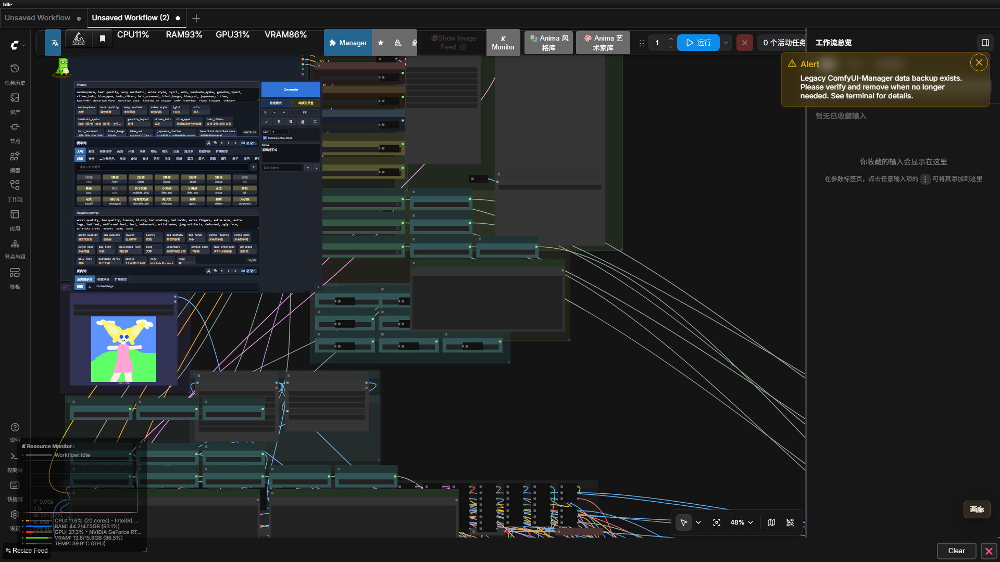
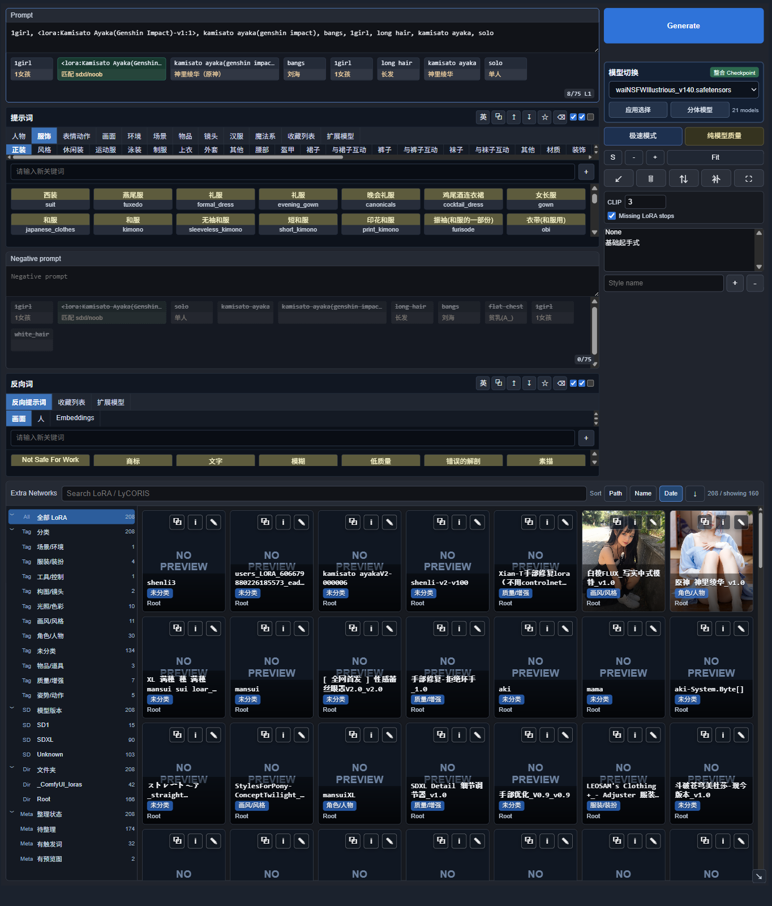
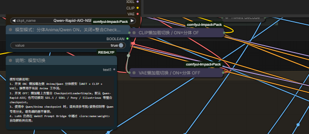
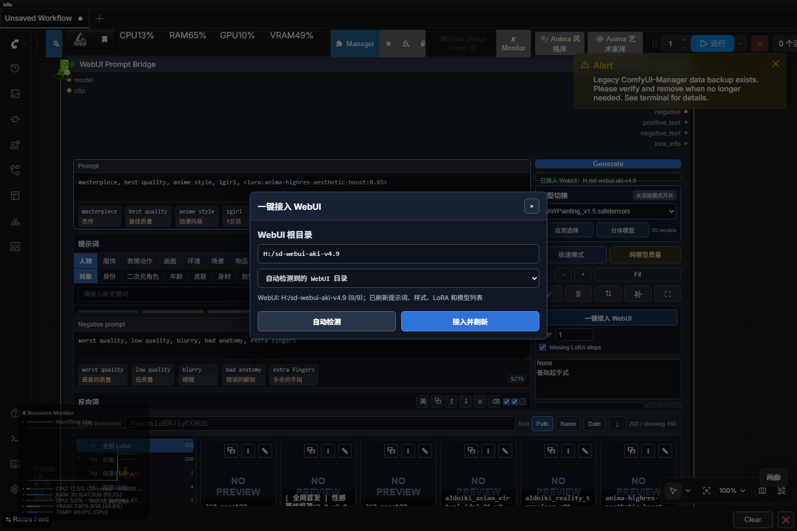

# ComfyUI WebUI Prompt Bridge



## 中文介绍

**ComfyUI WebUI Prompt Bridge** 是一个给 ComfyUI 使用的 WebUI 式提示词编辑节点。它把 WebUI 里顺手的提示词输入、Tag 编辑、中文翻译、自动补全、收藏、负面词管理和 LoRA 检测搬进 ComfyUI，让复杂工作流也能拥有接近 WebUI 的提示词操作体验。

很多人用 ComfyUI 时会遇到两个问题：

- ComfyUI 的普通文本框适合连接节点，但不适合大量编辑 Tag。
- WebUI 的提示词体验很好，但工作流能力不如 ComfyUI 灵活。

这个节点就是把两边的优点合到一起：**ComfyUI 负责工作流，WebUI Prompt Bridge 负责提示词操作**。

新用户可以先从中文最小工作流教程开始：`docs/tutorial-minimal-workflows.md`。教程分别演示 Anima 分体模型和 XL 整合 checkpoint 的最小接线，并配有截图和可直接拖入 ComfyUI 的 JSON 工作流。

## v0.1.7 更新说明

这一版重点修复提示词面板的布局体验：Prompt 文本框、已输入 tag 区、Prompt All in One 标签区和 Extra Networks 之间的高度都可以拖动调整；反向提示词折叠后会释放空间，不再留下大块空白；tag 编辑工具条也会自动避开底部面板和右侧滚动条，减少被遮挡的问题。

使用小技巧：在已输入的提示词 tag 上双击，可以隐藏/禁用这个 tag，再双击可以恢复；被禁用的 tag 不会写入生成提示词。

下一个版本计划增加更详细的设置功能，把翻译、布局、标签显示、LoRA 卡片和本机 WebUI 接入选项整理到更清晰的设置面板里。

完整更新记录见 `CHANGELOG.md`。

## 节点特写



这个节点不是普通的大文本框，而是一个完整的提示词操作面板。新版面板把 Prompt、反向词、模型切换、LoRA 卡片库和常用生成按钮集中到一个节点里：

- 可以直接输入中文自然语言，并自动翻译成更适合模型的英文提示词。
- 可以把提示词拆成一个个标签块，方便编辑、删除、禁用、复制、加权和拖拽排序。
- 可以像 WebUI 一样浏览分类标签，例如人物、服饰、表情、动作、画面、环境、负面词等。
- 可以收藏常用提示词，也可以读取历史记录。
- 可以读取 WebUI 的 `styles.csv` 样式。
- 可以接入 WebUI 的 Prompt All in One 和 TagComplete 数据。
- 可以识别 `<lora:name:weight>`，检查 LoRA 是否存在，并真正应用到 ComfyUI 的 model / clip 链路里。
- 可以在节点内直接浏览 LoRA / LyCORIS 卡片库，按文件夹、分类、模型版本和整理状态过滤。
- 可以读取 LoRA 预览图、训练 metadata、触发词、推荐权重、说明和手动分类，并在卡片里快速插入。
- 可以在面板右侧切换分体 Anima/Qwen 或整合 checkpoint，并在提交生成前做常见参数检查。

## 主要功能

- **中文自动翻译**：输入中文后可以转成英文提示词，适合不想手写英文 Tag 的用户。
- **WebUI 式标签编辑**：提示词以标签块显示，可视化操作比纯文本更直观。
- **自动补全**：输入字母时可以根据 TagComplete 词库提示可用 Tag。
- **收藏提示词**：常用角色、服装、画风、表情、动作可以收藏起来反复使用。
- **负面词管理**：正向提示词和反向提示词都可以分块编辑。
- **LoRA 真实加载**：不是只把 LoRA 文本塞进 prompt，而是解析 LoRA 标签后调用 ComfyUI 的 LoRA 加载逻辑。
- **LoRA 缺失提醒**：找不到 LoRA 时可以直接报错，避免你以为 LoRA 生效了但其实没用。
- **LoRA 卡片管理**：读取本地 LoRA 预览图和 safetensors metadata，支持搜索、分类、整理状态、触发词和推荐权重。
- **模型快速切换**：在 Bridge 面板里选择分体 Anima/Qwen 或任意整合 checkpoint，减少在复杂工作流里来回找节点。
- **生成前检查**：提交前检查空数字参数、Prompt/Negative 放反、悬空连接等常见问题，并尽量自动修复。
- **WebUI 数据桥接**：可以复用本机 WebUI 扩展里的标签、收藏、翻译配置和样式。

## 推荐工作流

仓库里已经带了一个推荐工作流：

```text
workflows/anima-webui-prompt-bridge.json
```

这个工作流是围绕 Anima / Qwen 图像模型整理的完整生图工作流，不只是一个单节点示例。它把提示词编辑、模型加载、LoRA、高清放大、脸部修复、手部修复、姿势控制、参考图控制和多种输出方式放在了一张图里。

如果你只想学习节点的最小接线，可以先看中文教程：

```text
docs/tutorial-minimal-workflows.md
```

教程里提供了两个最小工作流：

- `workflows/tutorial-minimal-anima-webui-prompt-bridge.json`：Anima 分体模型示例。
- `workflows/tutorial-minimal-xl-webui-prompt-bridge.json`：XL 整合 checkpoint 示例。

### 工作流包含什么

- **提示词主控节点**：用 WebUI Prompt Bridge 管理正向词、反向词、翻译、收藏、样式和 LoRA。
- **Anima 分体模型加载**：默认使用 `UNET + CLIP + VAE` 的 Anima/Qwen 分体结构。
- **整合模型切换**：也可以切到 `CheckpointLoaderSimple`，使用普通整合 checkpoint。
- **高清重绘**：支持 latent 放大后二次采样。
- **面部修复**：可选开启 Face Detailer。
- **手部修复**：可选开启 Hand Detailer，并且可以调检测阈值。
- **模型超分**：支持 RealESRGAN 等超分模型。
- **后期尺寸控制**：支持倍率缩放、目标总像素、固定宽高输出。
- **参考图控制**：可以接入参考图，引导画面风格或构图。
- **姿势控制**：支持 DWPose / OpenPose / Canny / Lineart 等预处理分支。

## 模型切换说明



工作流里有一个模型模式开关：

```text
模型模式：分体Anima/Qwen ON，关闭=整合Checkpoint
```

它的含义是：

- **开关 ON**：使用 Anima/Qwen 分体模型，也就是 `UNET + CLIP + VAE`。这是推荐默认模式，适合当前 Anima 工作流。
- **开关 OFF**：使用普通整合 checkpoint，也就是 `CheckpointLoaderSimple`。适合 SD1.5、SDXL、Pony、Illustrious、Qwen-Rapid-AIO 这类整合模型。

已验证：

- 分体 Anima/Qwen 模式可以正常生成。
- 整合 Checkpoint 模式可以用 `Qwen-Rapid-AIO-NSFW-v16.safetensors` 正常生成。

注意：切到普通 SDXL / Pony / Illustrious checkpoint 时，需要关闭参考图、Qwen Union 姿势控制等 Qwen 专用分支，避免编码器或模型结构不兼容。

## 需要准备的模型

推荐工作流默认会用到这些文件名：

- `anima_baseV10.safetensors`
- `anima_baseV10_txt.safetensors`
- `qwen_image_vae.safetensors`
- `RealESRGAN_x4plus_anime_6B.pth`
- 可选整合模型：`Qwen-Rapid-AIO-NSFW-v16.safetensors`
- 可选姿势 LoRA：`qwen_image_union_diffsynth_lora.safetensors`
- 可选 DWPose 检测器：`yolox_l.torchscript.pt`

仓库**不包含任何模型、LoRA、VAE、放大模型或检测器文件**。你需要自己下载并放到 ComfyUI 对应模型目录里。发布或分享工作流时也要注意每个模型自己的授权协议。

## 安全注意事项

这个节点会读取本机 WebUI/ComfyUI 的样式、提示词词库、LoRA metadata 和预览图，也会在用户主动操作时写入 `config.local.json`、`styles.csv`、Prompt-All-in-One storage 以及 LoRA 旁边的 metadata/preview 文件。请只接入你信任的 WebUI 目录，不要把未加认证的 ComfyUI 暴露到公网或不可信局域网。

后端接口会拒绝跨来源写请求，并限制上传图片类型、预览图大小和文本字段长度；如果你通过反向代理部署 ComfyUI，请确保代理正确传递 `Host`、`Origin` 或 `Referer` 头。

## 安装方法

### 方法一：ComfyUI-Manager 安装

本节点已经注册到 Comfy Registry，节点 ID 为：

```text
comfyui-webui-prompt-bridge
```

在 ComfyUI-Manager 中搜索下面任意关键词：

```text
ComfyUI WebUI Prompt Bridge
```

```text
comfyui-webui-prompt-bridge
```

点击安装并重启 ComfyUI。

### 方法二：通过 Git URL 安装

如果 ComfyUI-Manager 的本地索引还没有刷新，可以在 Manager 里使用 `Install via Git URL`，填入：

```text
https://github.com/dianfangsihuo/ComfyUI-WebUI-Prompt-Bridge.git
```

安装完成后重启 ComfyUI。

### 方法三：手动安装

把仓库克隆到 `ComfyUI/custom_nodes`：

```bash
git clone https://github.com/dianfangsihuo/ComfyUI-WebUI-Prompt-Bridge.git
```

如果你的 ComfyUI 环境缺依赖，再安装：

```bash
pip install -r ComfyUI-WebUI-Prompt-Bridge/requirements.txt
```

重启 ComfyUI 后，在节点菜单里添加：

```text
conditioning/webui -> WebUI Prompt Bridge
```

Registry 页面：

```text
https://registry.comfy.org/nodes/comfyui-webui-prompt-bridge
```

## 推荐使用步骤

1. 安装这个自定义节点。
2. 在 ComfyUI 里导入 `workflows/anima-webui-prompt-bridge.json`。可以直接把 JSON 拖进 ComfyUI 页面，也可以用菜单里的 `Load` 打开。
3. 按上面的模型列表放好模型文件。
4. 先保持模型模式开关为 ON，跑默认 Anima/Qwen 分体模式。
5. 在 WebUI Prompt Bridge 节点里输入中文或英文提示词。
6. 使用翻译、标签补全、收藏和分类标签整理提示词。
7. 如果提示词里写了 `<lora:name:weight>`，确认 LoRA 名字能被匹配到。
8. 需要更高清时再开启 HiRes、Face Detail、Hand Detail、Model Upscale。
9. 需要姿势或参考图时再打开对应开关。
10. 如果想换普通 checkpoint，把模型模式开关关掉，然后在备用整合模型节点里选择 checkpoint。

## 接入本机 WebUI 数据

如果你想要更接近 WebUI 的体验，可以连接你本机的 AUTOMATIC1111 WebUI 目录。推荐安装这两个 WebUI 扩展：

- `sd-webui-prompt-all-in-one`
- `a1111-sd-webui-tagcomplete`

最简单的方法：在节点右侧点击 `一键接入 WebUI`，只选择或填写 WebUI 根目录，例如 `H:/sd-webui-aki-v4.9`。节点会自动接入 `styles.csv`、Prompt All in One、TagComplete、LoRA、checkpoint、VAE、embeddings、ControlNet 等常用数据，不需要用户自己找 CSV 或复制多个路径。



看到 `WebUI: ... (9/9)` 就表示接入成功。接入后会立即刷新提示词、样式、LoRA 和模型列表。如果按钮提示“后端接口未加载”，重启一次 ComfyUI 再打开节点即可。

如果要手动配置，也可以复制 `config.local.example.json` 为 `config.local.json`，然后改成本机路径：

```json
{
  "webui_root": "X:/path/to/stable-diffusion-webui",
  "prompt_all_in_one_dir": "X:/path/to/stable-diffusion-webui/extensions/sd-webui-prompt-all-in-one",
  "tagcomplete_dir": "X:/path/to/stable-diffusion-webui/extensions/a1111-sd-webui-tagcomplete",
  "webui_python_site_packages": "X:/path/to/stable-diffusion-webui/python/Lib/site-packages",
  "styles_file": "X:/path/to/stable-diffusion-webui/styles.csv",
  "model_paths": {
    "loras": "X:/path/to/stable-diffusion-webui/models/Lora",
    "checkpoints": "X:/path/to/stable-diffusion-webui/models/Stable-diffusion",
    "vae": "X:/path/to/stable-diffusion-webui/models/VAE",
    "embeddings": "X:/path/to/stable-diffusion-webui/embeddings",
    "controlnet": "X:/path/to/stable-diffusion-webui/models/ControlNet",
    "upscale_models": "X:/path/to/stable-diffusion-webui/models/ESRGAN",
    "hypernetworks": "X:/path/to/stable-diffusion-webui/models/hypernetworks"
  }
}
```

`config.local.json` 不会被提交到 GitHub，所以你的本机路径不会被公开。

## LoRA 怎么写

直接在正向提示词里写：

```text
1girl, blue dress, standing by the sea, <lora:my-style-lora:0.75>
```

节点会做几件事：

1. 从提示词里解析出 LoRA 标签。
2. 到 ComfyUI 的 `loras` 目录里查找对应文件。
3. 找到后把 LoRA 应用到 model 和 clip。
4. 把 LoRA 标签从最终文本提示词里移除，避免污染编码文本。
5. 如果找不到 LoRA，并且开启了 `Missing LoRA stops`，就停止生成并报错。

这样可以避免一个很常见的问题：提示词里写了 LoRA，但实际模型根本没加载。

## 常见问题

**为什么我写了 LoRA 但没有效果？**

先确认 LoRA 文件真的在 ComfyUI 的 `models/loras` 目录里，并且名字能被节点匹配到。开启 `Missing LoRA stops` 后，找不到 LoRA 会直接报错，方便定位问题。

**为什么切到普通 checkpoint 后姿势或参考图报错？**

有些参考图和姿势分支是给 Qwen / Anima 结构准备的。普通 SDXL、Pony、Illustrious 模型不一定兼容。先关闭这些分支，只保留基础生图，确认能跑后再逐个打开。

**为什么自动翻译不完整？**

如果没有连接本机 WebUI 的 Prompt All in One 翻译接口，就只能使用内置兜底逻辑。想要更完整的联网翻译，请配置 `config.local.json` 指向本机 WebUI 扩展目录。

**为什么仓库不带模型？**

模型、LoRA、VAE、放大模型都有自己的授权协议，不能随便打包进插件仓库。这个项目只发布节点和示例工作流。

## English Summary

ComfyUI WebUI Prompt Bridge is a WebUI-style prompt editor for ComfyUI. It supports visual prompt chips, Chinese-to-English prompt translation, autocomplete, favorites, styles, prompt history, LoRA tag parsing and real LoRA application through ComfyUI model / CLIP objects.

The repository includes a recommended Anima workflow with lazy model switching, HiRes, detailers, pose/reference branches and multiple upscale output modes.

## License

MIT. See `LICENSE`.
